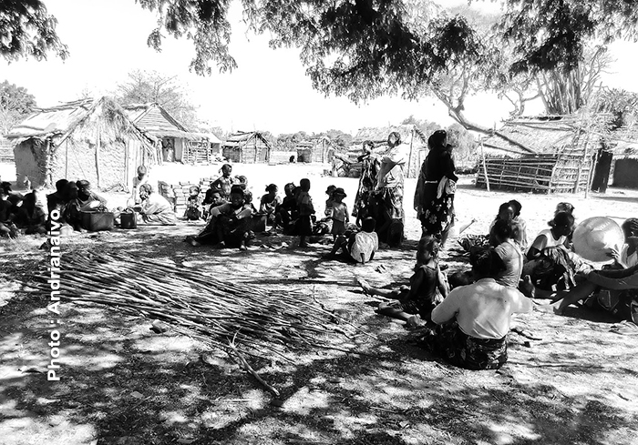

## Blog

#### Le réseau bimodal est plus associé à une déclaration d’état viable
Nos travaux montrent que la viabilité des agriculteurs familiaux malgaches pourrait être partiellement liée aux pratiques socialisées de sécurisation face aux chocs, incluant des soutiens interpersonnels et organisationnels au sein des réseaux de sécurisation. Nous avons caractérisé ces réseaux grâce à une typologie, en mobilisant des analyses multidimensionnelles (correspondances multiples et classifications hiérarchiques) sur une base de données collectée dans deux communes de la région malgache d’Itasy.

Quatre types de réseaux émergent : un réseau bimodal (personnes physiques et organisations) et trois interpersonnels. Le réseau bimodal est plus associé à une déclaration d’état viable.
Nos travaux montrent que la viabilité des agriculteurs familiaux malgaches pourrait être partiellement liée aux pratiques socialisées de sécurisation face aux chocs, incluant des soutiens interpersonnels et organisationnels au sein des réseaux de sécurisation. Nous avons caractérisé ces réseaux grâce à une typologie, en mobilisant des analyses multidimensionnelles (correspondances multiples et classifications hiérarchiques) sur une base de données collectée dans deux communes de la région malgache d’Itasy. Quatre types de réseaux émergent : un réseau bimodal (personnes physiques et organisations) et trois interpersonnels. Le réseau bimodal est plus associé à une déclaration d’état viable.
Nos travaux montrent que la viabilité des agriculteurs familiaux malgaches pourrait être partiellement liée aux pratiques socialisées de sécurisation face aux chocs, incluant des soutiens interpersonnels et organisationnels au sein des réseaux de sécurisation.

Nous avons caractérisé ces réseaux grâce à une typologie, en mobilisant des analyses multidimensionnelles (correspondances multiples et classifications hiérarchiques) sur une base de données collectée dans deux communes de la région malgache d’Itasy. Quatre types de réseaux émergent : un réseau bimodal (personnes physiques et organisations) et trois interpersonnels. Le réseau bimodal est plus associé à une déclaration d’état viable.
Nos travaux montrent que la viabilité des agriculteurs familiaux malgaches pourrait être partiellement liée aux pratiques socialisées de sécurisation face aux chocs, incluant des soutiens interpersonnels et organisationnels au sein des réseaux de sécurisation.

Nous avons caractérisé ces réseaux grâce à une typologie, en mobilisant des analyses multidimensionnelles (correspondances multiples et classifications hiérarchiques) sur une base de données collectée dans deux communes de la région malgache d’Itasy. Quatre types de réseaux émergent : un réseau bimodal (personnes physiques et organisations) et trois interpersonnels. Le réseau bimodal est plus associé à une déclaration d’état viable.